<table>
    <tr>
        <td>
            
        </td>
        <td>
            
        </td>
        <td rowspan="2">
            
        </td>
    </tr>
    <tr>
        <td>
            
        </td>
        <td>
            
        </td>
    </tr>
</table>

<h2>Recent activity</h2>

<pre>
[+]─[17-08-2026]▶[<a href="https://github.com/Ex-iT/ishetaldonderdag">ishetaldonderdag</a>]
 └─ <a href="https://github.com/Ex-iT/ishetaldonderdag/commit/c30554773b8ec62bec9321f4f350c5c7f1feb428">Added sitemap.xml</a>
[+]─[17-08-2026]▶[<a href="https://github.com/Ex-iT/P2K2">P2K2</a>]
 └─ <a href="https://github.com/Ex-iT/P2K2/commit/808e8b03bfa7e5c9d23f27adaf1e3e44f8747b26">Added standard pnpm install</a>
[+]─[17-08-2026]▶[<a href="https://github.com/Ex-iT/P2K2">P2K2</a>]
 └─ <a href="https://github.com/Ex-iT/P2K2/commit/9eb3d433964f6b626c697b88b3f5e6956af26baf">Fixed pnpm mismatch</a>
[+]─[17-08-2026]▶[<a href="https://github.com/Ex-iT/P2K2">P2K2</a>]
 └─ <a href="https://github.com/Ex-iT/P2K2/commit/ceab87208edf26803d625c1650c6efa2295c0945">Updated TailwindCSS</a>
[+]─[17-08-2026]▶[<a href="https://github.com/Ex-iT/P2K2">P2K2</a>]
 └─ <a href="https://github.com/Ex-iT/P2K2/commit/8b34f5a117c1c6187f28d636bb7f16afbea0651b">Updated to be compatible with Node v24</a>
[+]─[17-08-2026]▶[<a href="https://github.com/Ex-iT/CDR-Player">CDR-Player</a>]
 └─ <a href="https://github.com/Ex-iT/CDR-Player/commit/94b70b8b135550cbf540d92242d9385eca538cdf">Updated AGENTS.md</a>
[+]─[17-08-2026]▶[<a href="https://github.com/Ex-iT/CDR-Player">CDR-Player</a>]
 └─ <a href="https://github.com/Ex-iT/CDR-Player/commit/fd4d3ef8aa9a27b29ca4c300bae01b5cf3fd8a5a">Fixed config mismatch</a>
[+]─[17-08-2026]▶[<a href="https://github.com/Ex-iT/CDR-Player">CDR-Player</a>]
 └─ <a href="https://github.com/Ex-iT/CDR-Player/commit/c4dbf1617be4a723e0050c5fec202ec85300ff8c">Fixed imports and timer duplication logic</a>
[+]─[17-08-2026]▶[<a href="https://github.com/Ex-iT/CDR-Player">CDR-Player</a>]
 └─ <a href="https://github.com/Ex-iT/CDR-Player/commit/0fd48071af7befdca54154816462eca7ae309c36">Fixed time of the day discrepancy</a>
[+]─[16-08-2026]▶[<a href="https://github.com/Ex-iT/CDR-Player">CDR-Player</a>]
 └─ <a href="https://github.com/Ex-iT/CDR-Player/commit/724062cd4fca4988c428e371d945a9f20171dad2">Fixed code review findings</a>
[+]─[16-08-2026]▶[<a href="https://github.com/Ex-iT/ishetaldonderdag">ishetaldonderdag</a>]
 └─ <a href="https://github.com/Ex-iT/ishetaldonderdag/commit/f97afb7e81ade1cc9c880428225ae4935b8e3a20">Added RSS feed</a>
[+]─[16-08-2026]▶[<a href="https://github.com/Ex-iT/ishetaldonderdag">ishetaldonderdag</a>]
 └─ <a href="https://github.com/Ex-iT/ishetaldonderdag/commit/d6a3c668d2f73991035151eb374b5366099b058f">Updated docs</a>
[+]─[16-08-2026]▶[<a href="https://github.com/Ex-iT/ishetaldonderdag">ishetaldonderdag</a>]
 └─ <a href="https://github.com/Ex-iT/ishetaldonderdag/commit/70078f97043b67828f94875bbca3b77550f7f687">Reverted to flask_minify</a>
[+]─[16-08-2026]▶[<a href="https://github.com/Ex-iT/ishetaldonderdag">ishetaldonderdag</a>]
 └─ <a href="https://github.com/Ex-iT/ishetaldonderdag/commit/579c56914f26da22b7dc72ba55f335b375783163">Handle Vercel first request static assets</a>
[+]─[16-08-2026]▶[<a href="https://github.com/Ex-iT/ishetaldonderdag">ishetaldonderdag</a>]
 └─ <a href="https://github.com/Ex-iT/ishetaldonderdag/commit/0ed128d3e4497635b5e06d7fcc4994049ddf0b87">Fixed conflicting static route</a>
</pre>